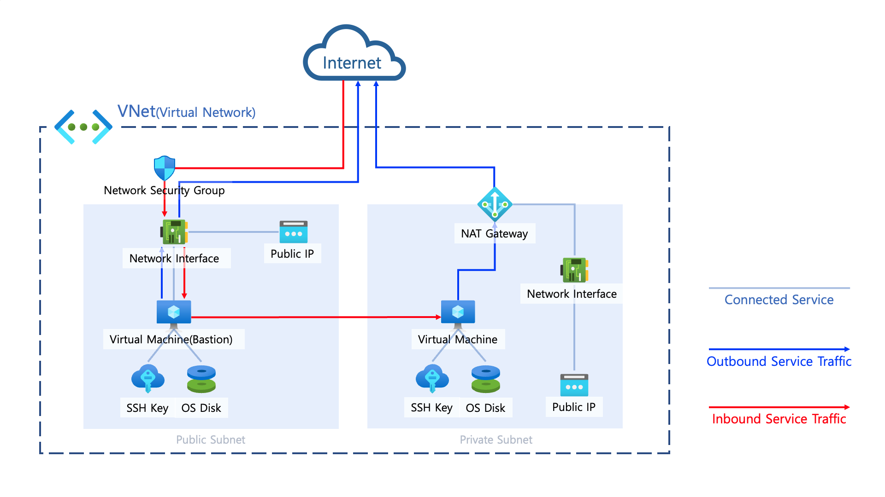

## Bastion components

- The bastion host can be said to be the first endpoint that developers access in Azure infrastructure.
- Azure has a PaaS service called Bastion, but it is difficult for developers to easily control or access with SSH, so a VM is created and used for Bastion purposes.
- Deployed in a public subnet, it is built as a secure endpoint that can access the private subnet through inbound/outbound rule settings that can be applied later.

### How to provision
- Sequentially create VM, NSG, NIC, multiple associations, etc.
```zsh
$ terraform init -backend-config=config/backend.tfvars
$ terraform plan -var-file=config/custom.tfvars -var-file=config/backend.tfvars
$ terraform apply -var-file=config/custom.tfvars -var-file=config/backend.tfvars
```

### How to access bastion using SSH
```zsh
# After deploying bastion host
# Save the ssh key generated via azapi_resource_action locally
$ terraform output bastion_ssh_private_key >> ~/.ssh/bastion_ssh_key
$ terraform output bastion_ssh_public_key >> ~/.ssh/bastion_ssh_key.pub
$ chmod 400 ~/.ssh/bastion_ssh_key.pub 
$ chmod 400 ~/.ssh/bastion_ssh_key

# Connect bastion using SSH
$ ssh {admin_user}@{bastion_public_ip} -i ~/.ssh/bastion_ssh_key
```

### Basic Bastion Architecture
