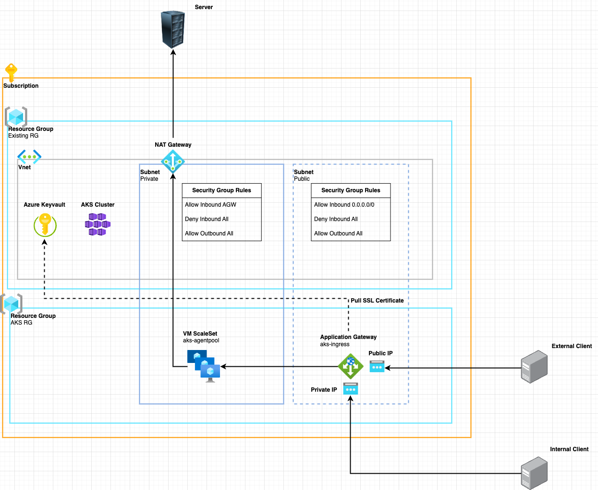

## Kubernetes components

- AKS (Azure Kubernetes Service) component, an Azure PaaS service for using Kubernetes for container orchestration. 
- In addition, log analytics workspace and solution are included for deployed AKS monitoring.
- It is currently implemented as a default option, and various functions and options will be added in the future to suit users. (ex) Application Gateway

### How to provision
- Sequentially create AKS, Log analytics service
```zsh
$ terraform init -backend-config=config/backend.tfvars
$ terraform plan -var-file=config/custom.tfvars -var-file=config/backend.tfvars
$ terraform apply -var-file=config/custom.tfvars -var-file=config/backend.tfvars
```

### How to configure Kubernetes
```
# Configure kubectl
$ az aks get-credentials --resource-group {resource_group_name} --name $(terraform output -raw kubernetes_cluster_name)

# Install kubectl
$ brew install kubectl

# Check installed version
$ kubectl version --client

# Get cluster nodes
$ kubectl get nodes

# Browse Kubernetes dashboad (Azure console)
$ az aks browse --resource-group {resource_group_name} --name $(terraform output -raw kubernetes_cluster_name)

# Install Kubernetes TUI(Terminal User Interface) Tool (k9s)
$ brew install k9s
$ k9s
```

### Basic Network Architecture

