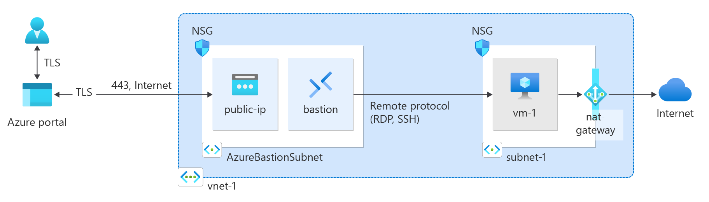

## Network components

- As a component for building a virtual network, Vnet, public/private subnet, NAT, network interface, and security group provisioning are used to separate the public and private subnet to improve security.
- The bastion host will be deployed in the public subnet, and mainly AKS nodes or other worker nodes will be deployed in the private subnet and communicate with the outside internet through the NAT gateway.

### How to provision
- Sequentially create VNet, subnets, NAT gateway, multiple associations, NSG, etc.
```zsh
$ terraform init -backend-config=config/backend.tfvars
$ terraform plan -var-file=config/custom.tfvars -var-file=config/backend.tfvars
$ terraform apply -var-file=config/custom.tfvars -var-file=config/backend.tfvars
```

### Basic Network Architecture

